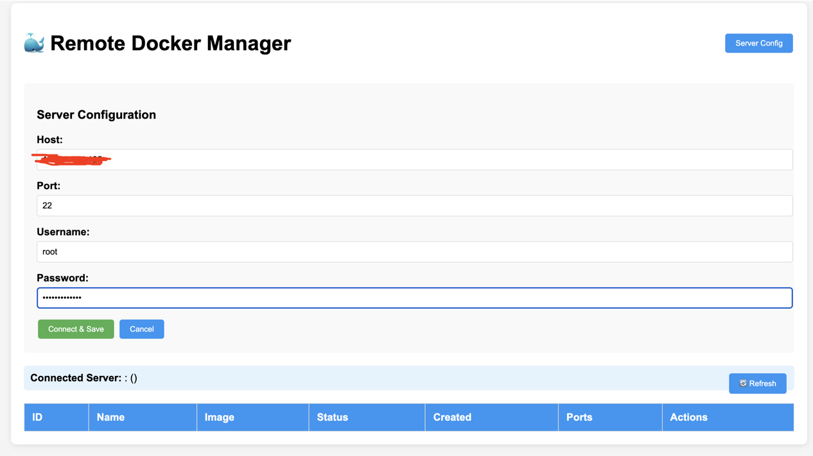
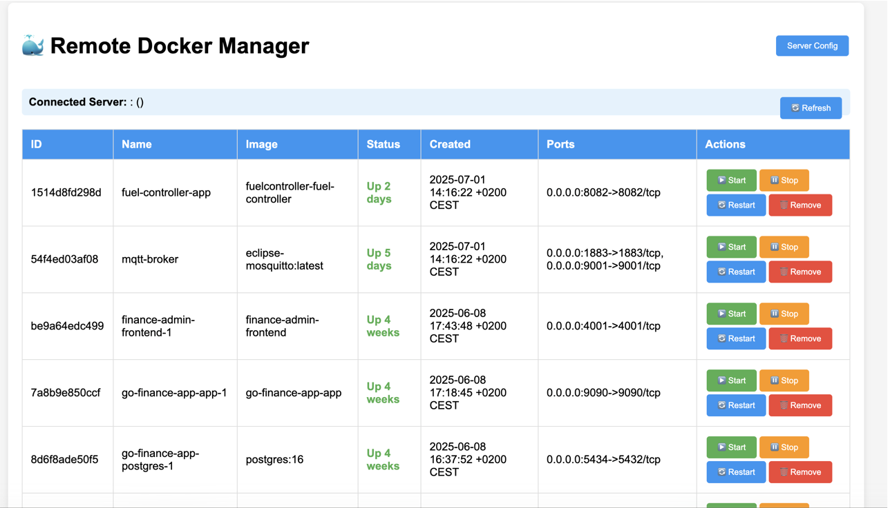

# 🐳 Remote Docker Manager

A web-based Docker container management tool built with Go that allows you to remotely manage Docker containers on any Linux server via SSH connection. Monitor, start, stop, restart, and remove containers through an intuitive web interface.

## ✨ Features

- **Remote SSH Connection**: Connect to any Linux server with Docker installed
- **Container Management**: List, start, stop, restart, and remove containers
- **Real-time Updates**: Live container status monitoring
- **Web Interface**: Clean and responsive UI
- **Security**: Non-root user execution in Docker
- **Health Checks**: Built-in container health monitoring
- **Cross-platform**: Runs on any system with Docker support

## 🚀 Quick Start

## Screenshots

### Figure 1.1


### Figure 1.2


### Prerequisites

- Docker installed
- Go 1.24+ (for development)
- Target Linux server with Docker and SSH access

### Option 1: Using Docker Compose (Recommended)

```bash
# Start the application
docker-compose up -d

# View logs
docker-compose logs -f

# Stop the application
docker-compose down
```

### Option 2: Manual Docker Commands

```bash
# Build the image
docker build -t remote-docker-manager:latest .

# Run the container
docker run -d \
  --name remote-docker-manager \
  -p 8080:8080 \
  --restart unless-stopped \
  remote-docker-manager:latest

# View logs
docker logs -f remote-docker-manager

# Stop and remove
docker stop remote-docker-manager
docker rm remote-docker-manager
```

### Option 3: Development Mode

```bash
# Install dependencies
go mod tidy

# Run locally
go run main.go
```

## 🔧 Usage

1. **Access the Web Interface**
    - Open your browser and navigate to `http://localhost:8080`

2. **Configure Server Connection**
    - Click the "Server Config" button
    - Enter your remote server details:
        - **Host**: IP address or hostname (e.g., `<server_ip>`)
        - **Port**: SSH port (usually `22`)
        - **Username**: SSH username
        - **Password**: SSH password
    - Click "Connect & Save"

3. **Manage Containers**
    - View all containers (running and stopped)
    - Use action buttons to:
        - ▶️ **Start** stopped containers
        - ⏸️ **Stop** running containers
        - 🔄 **Restart** containers
        - 🗑️ **Remove** containers
        - 📝 **Log** containers
    - Click "🔄 Refresh" to update container list

## 📋 API Endpoints

| Method | Endpoint | Description                 |
|--------|----------|-----------------------------|
| `GET`  | `/` | Web interface               |
| `GET`  | `/health` | Health check                |
| `POST` | `/api/config` | Configure server connection |
| `GET`  | `/api/containers` | List all containers         |
| `POST` | `/api/container/{id}/start` | Start a container           |
| `POST` | `/api/container/{id}/stop` | Stop a container            |
| `POST` | `/api/container/{id}/restart` | Restart a container         |
| `POST` | `/api/container/{id}/remove` | Remove a container          |
| `GET`  | `/api/logs/{id}` | Log a container             |

## 🐳 Docker Configuration

### Environment Variables

| Variable | Description | Default |
|----------|-------------|---------|
| `PORT` | Application port | `8080` |
| `TZ` | Timezone | `Asia/Baku` |

### Building from Source

```bash
# Install dependencies
go mod tidy

# Build binary
go build -o main .

# Run
./main
```

## 🔐 Security Considerations

- **SSH Credentials**: Credentials are stored in memory only and not persisted
- **Non-root Execution**: Container runs as non-root user (uid: 1001)
- **Network Security**: Ensure your remote server has proper SSH security configured
- **Firewall**: Configure firewall rules appropriately for SSH access

## 🚨 Troubleshooting

### Common Issues

1. **"SSH connection failed"**
    - Verify host IP, port, username, and password
    - Ensure SSH service is running on target server
    - Check firewall settings

2. **"Docker is not available"**
    - Ensure Docker is installed on remote server
    - Verify user has Docker permissions: `sudo usermod -aG docker $USER`
    - Check if Docker daemon is running: `sudo systemctl status docker`

3. **"No containers found"**
    - This is normal if no containers exist
    - Try creating a test container: `docker run hello-world`

4. **Container won't start**
    - Check container logs on remote server
    - Verify container configuration
    - Ensure no port conflicts

### Debugging

Enable detailed logging by checking the application logs:

```bash
# Docker logs
docker logs -f remote-docker-manager

# Or with docker-compose
docker-compose logs -f
```

## 📄 Project Structure

```
remote-docker-manager/
├── main.go              # Main application code
├── go.mod               # Go module dependencies
├── go.sum               # Dependency checksums
├── Dockerfile           # Docker build instructions
├── .dockerignore        # Docker ignore patterns
├── docker-compose.yml   # Docker compose configuration
└── README.md            # This file
```

## 🤝 Contributing

1. Fork the repository
2. Create a feature branch
3. Commit your changes
4. Push to the branch
5. Open a Pull Request
